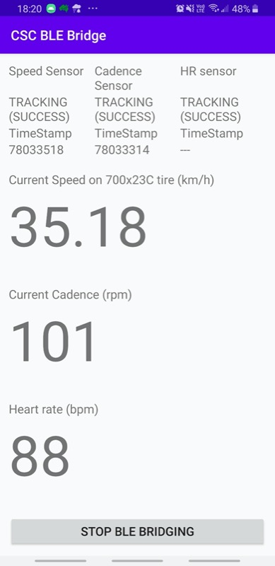

# What

This is an Ant+ to BLE (Bluetooth Low Energy) Bridging app for ANT+ Cycling Speed and Cadence (CSC) sensors and ANT+ heart rate sensors.
The app will act as a Cycling speed/cadence and/or HR BLE sensor so other BLE device (phone, PC, Mac, tablet) can reads data from ANT+ sensors.

## Details

This is an Android app which reads ANT+ cycling speed/cadence (CSC) and/or heart rate sensors in the background (actually in an Android foreground service), and advertises itself as a `Bluetooth Low Energy (BLE)` device which implements `Cycling Speed and Cadence Profile (CSCP)` and `Heart Rate Profile (HRP)` so that other devices can see this Android device as a Cycling Speed and Cadence Bluetooth and/or Heart Rate BLE sensor.

This is useful when you only have ANT+ CSC/HR sensors but you want to connect to them as BLE sensors (provided that you don't have an USB ANT+ stick around but happen to have an ANT+ enabled Android device like a Samsung phone).

Long hold on the sensors name on top of the screen to rescan for Ant+ devices after the "Start BLE bridging" button has been pressed. All sensors will automatically scan for Ant+ sources when the "Start BLE bridging" button is pressed.

# Why

I want to try out Zwift desktop version but I can't get a USB ANT+ Stick anywhere now in my country (due to the C-19 pandemic). So I decided to write one.

I can now sees my speed and cadence coming from ANT+ sensors on Zwift Mac without the need of extra hardware.

Special thanks to [pinkemma](https://github.com/pinkemma) who implements Heart Rate sensor profile so that this app also reads heart rate from ANT+ sensor and bridges it to bluetooth. (see [PR #5](https://github.com/starryalley/CSC_BLE_Bridge/pull/5) since 10/2020)

# Tested devices

## ANT+ and BLE enabled Android devices
- Samsung Galaxy S8 (Android 9)
- Samsung Galaxy J5 2016 - Thanks [louisJ20](https://github.com/louisJ20)
- Samsung Galaxy S9 (Android 10) - Thanks [pinkemma](https://github.com/pinkemma)
- One Plus 7 Pro (Android 10) - Thanks [michaelrhughes](https://github.com/michaelrhughes)
- Nokia 7 Plus - Thanks [leaskovski](https://github.com/leaskovski)
- OnePlus 5T (Android 10) - Thanks [philharle](https://github.com/philharle)

## ANT+ Speed/Cadence sensors
- [Garmin gen 1 ANT+ only speed and cadence sensor](https://buy.garmin.com/en-MW/ssa/p/146897)
- [Garmin speed cadence combined sensor](https://www.thisisant.com/directory/gsc-10-speed-cadence-bike-sensor) - Thanks [louisJ20](https://github.com/louisJ20)

## ANT+ Heart Rate sensors
- [Garmin HRM-Run](https://buy.garmin.com/en-AU/AU/p/530376)
- Garmin HRM3-SS - Thanks [philharle](https://github.com/philharle)
- Garmin Fenix 5s with broadcasting mode on (ANT+ signal) - Thanks [pinkemma](https://github.com/pinkemma)
- Garmin 935 with broadcasting mode on (ANT+ signal)
- Garmin Fenix 6 with broadcasting mode on (ANT+ signal) 

## Apps that use BLE sensors
- Zwift (Mac version)
- The Sufferfest (Mac version)
- theoretically all other apps that use Speed/Cadence/Heart Rate BLE sensors

# Known issues

- On my Samsung S8 sometimes the bluetooth PHY is messed up (for unknown reason). I have to reboot the phone to get it working. (When it doesn't work, the advertising reports success but actually you can't see any).

# Reference

Code samples:
- [Bluetooth GATT Server Sample](https://github.com/androidthings/sample-bluetooth-le-gattserver)
- [Android ANT+ SDK sample](https://www.thisisant.com/resources/android-ant-sdk/)

Spec and Document
- [ANT+ Basic](https://www.thisisant.com/developer/ant/ant-basics)
- [Introduction to Bluetooth low energy](https://learn.adafruit.com/introduction-to-bluetooth-low-energy/gatt)
- [CH4 of Getting Started with Bluetooth Low Energy](https://www.oreilly.com/library/view/getting-started-with/9781491900550/ch04.html)
- [Bluetooth GATT Specifications](https://www.bluetooth.com/specifications/gatt)
  - Cycling Speed and Cadence Profile/Service
  - Heart Rate Profile/Service
  - [Bluetooth Assigned numbers](https://www.bluetooth.com/specifications/assigned-numbers/service-discovery/)
